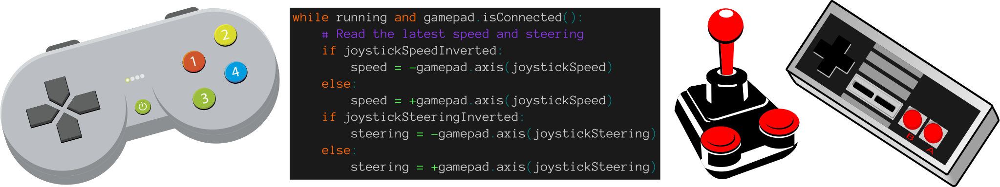
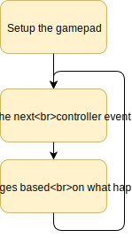
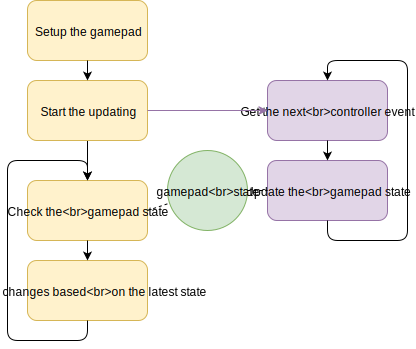
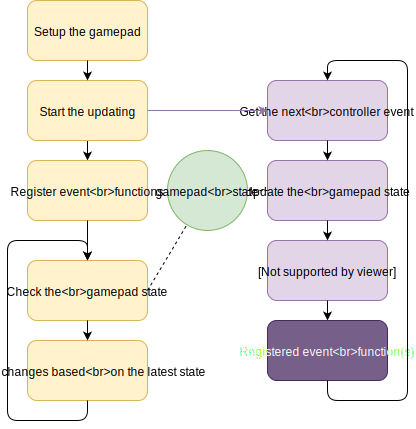

# PiBorg Gamepad Library



The Gamepad library provides a simple way of getting inputs from joysticks, gamepads, and other game controllers.

Both buttons and axes / joysticks can be referenced by names as well as their raw index numbers.  These can be easily customised and new controllers can easily be added as well.

It is designed and tested for the Raspberry Pi, but it should work with an Linux install and any device which shows up as a ```/dev/input/js?``` device.

Gamepad only uses imports which are part of the standard Python install and works with both Python 2 and 3.

Multiple controllers are also supported, just create more than one ```Gamepad``` instance with different joystick IDs.

See our other projects on GitHub [here](https://github.com/piborg) :)

# Installing the Library
```
cd ~
git clone https://github.com/piborg/Gamepad
```
That's it. The library does not need installing, it just needs to be downloaded.

# The Gamepad Library
The library provides three basic modes for getting updates from your controller:

1. Polling - we ask the library for the next controller update one at a time.
2. Asynchronous - the controller state is updated in the background.
3. Event - callbacks are made when the controller state changes.

See the examples further down for an explanation of how each mode is used.

The library itself is contained in just two scripts:

## ```Gamepad.py```
The main library, this script contains all of the code which reads input from the controller.  It contains the ```Gamepad``` class which has all of the logic used to decode the joystick events and store the current state.

It works with both the raw axis / joystick and button numbers and easy to read names.  It also contains the threading code needed to handle the background updating used in the asynchronous and event modes.

This script can be run directly using ```./Gamepad.py``` to check your controller mappings are correct or work out the mapping numbers for your own controller.

## ```Controllers.py```
This script contains the layouts for the different controllers.  Each controller is represented by its own class inheriting from the main ```Gamepad``` class.

If the mapping is not right for you the layout for both the axis / joystick names and the button names by editing these classes.  Adding your own controller is also simple, just make your own class based on the example at the bottom :)

Any button or axis without a name can still be used by the raw number if needed.  This also means the ```Gamepad``` class can be used directly if you are only using the raw numbers.

This script is not run directly, instead it is read by ```Gamepad.py``` so that all of the devices are available when Gamepad is imported.

# Examples

## Polling mode - ```PollingExample.py```
The polling mode is probably the simplest and uses the Gamepad library to decode controller events one at a time.



It works by repeatedly calling the ```getNextEvent()``` function to get the next update from the controller in the order they occurred.  Each call returns three things:

1. The event type.  This is either ```'BUTTON'``` for button presses or ```'AXIS'``` for axis / joystick movements.
2. The control which changed.  This is a string with the name if available, or the index number if no name was available.
3. The new value for the control.  For buttons this is ```True``` or ```False```, for axis / joystick movement it is a position between -1.0 and +1.0.

For example if the circle button on your controller was just pressed you would get ```'BUTTON', 'CIRCLE', True``` as the result.

Polling mode cannot be used at the same time as the asynchronous or event modes as they read the controller events for you.

## Asynchronous mode - ```AsyncExample.py```
Asynchronous mode works by reading the controller events in a background thread and updating the objects state to match the controller.



It is started by calling the ```startBackgroundUpdates()``` function and should be stopped at the end of your script by calling the ```disconnect()``` function.

The current controller state can be queried using the following functions:

* ```isConnected()``` - check if the controller is still connected.
* ```isPressed(X)``` - check if a button is currently pressed.
* ```beenPressed(X)``` - see if a button was pressed since the last check.  Only returns ```True``` once per press.
* ```beenReleased(X)``` - see if a button was released since the last check.  Only returns ```True``` once per release.
* ```axis(X)``` - read the latest axis / joystick position.  This is a float number between -1.0 and +1.0.

In all cases ```X``` can either be the string based name or the raw index number (e.g. ```'CIRCLE'``` or ```1```).

Asynchronous mode cannot be used at the same time as the polling mode as it reads the controller events for you, but it can be used with event mode.

## Event mode - ```EventExample.py```
Event mode works by reading the controller events in a background thread and calling functions in your script when changes occur.


It is started by calling the ```startBackgroundUpdates()``` function and should be stopped at the end of your script by calling the ```disconnect()``` function.  The ```isConnected()``` function will return ```False``` if the controller is disconnected while running.

Once started you can register your functions to controller events using these calls:

* ```addButtonPressedHandler(X, F)``` - called when a button is pressed, no values passed.
* ```addButtonReleasedHandler(X, F)``` - called when a button is released, no values passed.
* ```addButtonChangedHandler(X, F)``` - called when a button changes state, boolean passed with ```True``` for pressed or ```False``` for released.
* ```addAxisMovedHandler(X, F)``` - called when an axis / joystick is moved, a float number between -1.0 and +1.0 is passed.

In all cases ```X``` can either be the string based name or the raw index number (e.g. ```'CIRCLE'``` or ```1```).  ```F``` is the function which gets called when the event occurs.

The same function can be registered with multiple events.  You can also register multiple functions with the same event.

You can also remove an already registered event using these calls if needed:

* ```removeButtonPressedHandler(X, F)``` - removes a callback added by ```addButtonPressedHandler```.
* ```removeButtonReleasedHandler(X, F)``` - removes a callback added by ```addButtonReleasedHandler```.
* ```removeButtonChangedHandler(X, F)``` - removes a callback added by ```addButtonChangedHandler```.
* ```removeAxisMovedHandler(X, F)``` - removes a callback added by ```addAxisMovedHandler```.
* ```removeAllEventHandlers()``` - removes all added callbacks for this controller.

Event mode cannot be used at the same time as the polling mode as it reads the controller events for you, but it can be used with asynchronous mode.

## Asynchronous and event mode - ```AsyncAndEventExample.py```
This is not really a mode, but an example of how the asynchronous and event modes can be used at the same time.  This is generally my preferred option as event mode is often easier to understand for button presses and asynchronous mode works well with axis / joystick movements.



The example script here is really a hybrid between the ```AsyncExample.py``` and ```EventExample.py``` examples.  Button callbacks are registered in the event style, then the loop only checks one button and the joystick positions.

In this style you are free to mix and match what you see as events and what you read the state of directly.

## Getting the available names - ```ListNames.py```
This example is just a helpful utility to print out all of the axis and button names for a controller type.  You can change the controller type by looking for this line:
```
gamepad = Gamepad.PS4()
```
and changing ```PS4``` to any available device name.

The list of device names is shown when you run ```./Gamepad.py``` directly.

## Custom controller in your own script - ```CustomGamepadExample.py```
This example shows how you can create a controller mapping in your own script without changing ```Controllers.py```.  This can be useful if you need to use different names in just one script, or if you want to keep all of your changes in your own code.

In this case you make your own class inheriting from ```Gamepad.Gamepad``` in the same way as they are written in ```Controllers.py```.  You do not have to set the ```fullName``` value.

## RockyBorg example - ```rockyJoy.py```
Here we have an actual use of the Gamepad library, controlling a [RockyBorg](https://www.piborg.org/rockyborg-white) robot :)

It works exactly like the old Pygame version of the ```rbJoystick.py``` example script, but with the addition of a button to end the script.

The controller and button layout is all specified towards the top of the script and the standard [RockyBorg library](https://github.com/piborg/rockyborg) is used to control the motors and servo.

## MonsterBorg example - ```monsterJoy.py```
Here we have another real-world use of the Gamepad library, controlling a [MonsterBorg](https://www.piborg.org/monsterborg) robot :)

This provides the same control scheme we usually use for our robots, plus buttons to toggle the LEDs and end the script.

The controller and button layout is all specified towards the top of the script and the standard [ThunderBorg](https://www.piborg.org/thunderborg) library is used to control the motors.

# Using Gamepad in your own project
If you are using ```Gamepad``` in your own script it will need access to both the ```Gamepad.py``` and ```Controllers.py``` scripts.  This can be done in a few ways:

1. Write your script in the Gamepad directory.
2. Copy the two scripts into your project's directory.
3. Add the Gamepad directory to your PYTHONPATH environment variable.
4. Add these lines to your script before importing the library: ```import sys``` and ```sys.path.insert(0, "/home/pi/Gamepad")```, where ```/home/pi/Gamepad``` is the Gamepad directory.

# Troubleshooting
For troubleshooting and further help please post questions on our [forum](http://forum.piborg.org/forum).

# Reporting Issues

If you find a bug with the RockyBorg code, please feel free to report it as an issue. When reporting issues with this library please fill in the issue report with as much information as you can to help us help you.

Please supply as much information as you can so we can replicate the bug locally. :)

